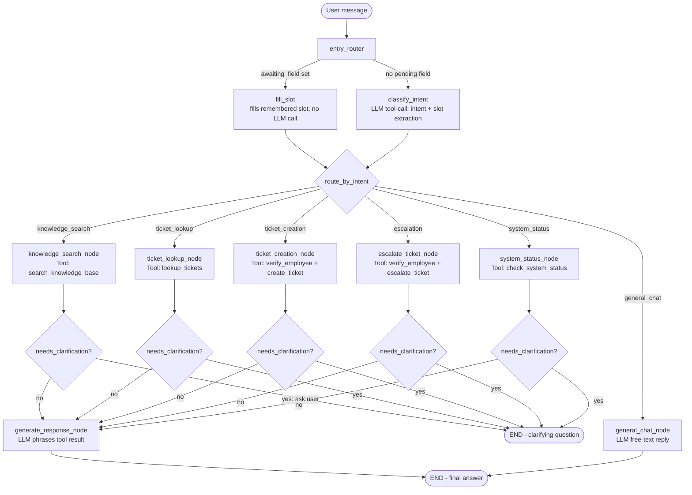

# AI IT Support Assistant
Live demo: https://ai-it-support-assistant-demo.streamlit.app/
An agentic AI IT-support chatbot built with **LangGraph**, **LLM Function**, and **Streamlit**. It understands an employee's request, decides which tool it needs, executes that tool against local sample data, and returns a clear, grounded response — while holding onto context (like an employee ID) across multiple turns of conversation.

---

## 1. Problem Statement

Employees at a fictional organization ("FictionalCorp") raise repetitive IT requests — "how do I reset my VPN password", "what's the status of my ticket", "my laptop is overheating, please log a ticket." Handling these manually (or through a rigid keyword-matching bot) is slow and inconsistent. We need an assistant that can:

- Understand free-form natural-language requests
- Decide *which* internal system/tool is relevant (knowledge base vs. ticket system)
- Ask for missing information instead of guessing
- Take action (create a ticket) safely, without inventing data or duplicating existing tickets
- Carry conversation context across multiple turns

## 2. Solution Overview

The assistant is built as a **LangGraph** state machine with five capabilities exposed as tools. LLM calls are routed through **OpenRouter** (an OpenAI-compatible API that can serve Claude, GPT, Llama, and other models through a single key), so the project only needs one `OPENROUTER_API_KEY` regardless of which underlying model you pick.

| Tool | Purpose |
|---|---|
| `search_knowledge_base` | Searches a local IT knowledge base for how-to articles |
| `lookup_tickets` | Looks up existing tickets by employee ID or ticket ID |
| `create_ticket` | Creates a new ticket after validating required fields and checking for duplicates |
| `escalate_ticket` | Escalates an existing ticket (raises priority to High) after verifying ownership |
| `check_system_status` *(bonus)* | Reports current status of internal systems (VPN, Email, Wi-Fi, Printing) |

An LLM call (Claude, via a forced tool call) classifies the user's intent and extracts only the information they explicitly stated. The graph then routes to the right tool node, executes it against local JSON data, and a second LLM call phrases the tool's raw result into a friendly reply. If required information is missing, the graph asks a clarifying question and remembers the answer on the next turn instead of restarting the conversation.

## 3. Architecture Diagram



**Key design point:** clarifying questions (e.g. "what's your employee ID?") are answered by `fill_slot` on the *next* turn without re-running the LLM classifier — the state (`awaiting_field`, `pending_intent`, `ticket_draft`) persists in Streamlit's session and is fed back into the graph each turn, which is how multi-turn memory is achieved without a database-backed checkpointer.

## 4. Technology Stack

- **Python 3.10+**
- **LangGraph** — workflow orchestration (state graph, conditional routing)
- **OpenRouter API** (OpenAI-compatible `chat.completions`) — intent classification (via forced tool/function-calling) and response generation; defaults to `anthropic/claude-3.5-sonnet` but any OpenRouter model slug works
- **Streamlit** — chat UI
- **Local JSON files** — employees, tickets, knowledge base, system status (no external DB needed)

## 5. Project Structure

```
ai-it-support-assistant/
├── app.py                     # Streamlit chat UI
├── agent/
│   ├── __init__.py
│   ├── state.py                # AgentState TypedDict (shared graph state)
│   ├── graph.py                 # LangGraph nodes, conditional edges, graph assembly
│   ├── tools.py                 # The 3 required tools + escalation + verify_employee + bonus status tool
│   ├── llm_client.py            # OpenRouter API wrapper (tool-forced classification + text generation)
│   └── db.py                    # Local JSON data access layer
├── data/
│   ├── employees.json
│   ├── tickets.json
│   ├── knowledge_base.json
│   └── system_status.json
├── requirements.txt
├── .env.example
├── .gitignore
└── README.md
```

## 6. Setup Instructions

```bash
# 1. Clone the repository
git clone <your-repo-url>
cd ai-it-support-assistant

# 2. Create a virtual environment
python3 -m venv venv
source venv/bin/activate        # Windows: venv\Scripts\activate

# 3. Install dependencies
pip install -r requirements.txt

# 4. Configure your API key
cp .env.example .env
# then edit .env and paste your OPENROUTER_API_KEY
```

> **Optional:** locally, Streamlit may print a harmless "No secrets found" console
> message the first time the app checks for Streamlit Cloud-style secrets (used only
> when deployed). It doesn't affect functionality -- `.env` above is all you need
> locally. To silence the message, copy `.streamlit/secrets.toml.example` to
> `.streamlit/secrets.toml` (even empty is fine); `.gitignore` already excludes the
> real file from version control.

## 7. Environment Variables

| Variable | Required | Description |
|---|---|---|
| `OPENROUTER_API_KEY` | Yes | Your OpenRouter API key. Get one at https://openrouter.ai/keys |
| `OPENROUTER_MODEL` | No | Overrides the default model (`anthropic/claude-3.5-sonnet`). Browse available slugs at https://openrouter.ai/models — pick any model that supports tool/function calling. |
| `OPENROUTER_SITE_URL` | No | Optional; sent as the `HTTP-Referer` header for OpenRouter analytics/rate-limit attribution. |
| `OPENROUTER_SITE_NAME` | No | Optional; sent as the `X-Title` header, shown in your OpenRouter dashboard. |

## 8. How to Run

```bash
streamlit run app.py
```

Then open the URL Streamlit prints (usually `http://localhost:8501`).

Use the sidebar's **🔄 Reset conversation** button to clear state and start over, and expand **Last tool result (debug)** to see the raw tool output behind each answer.

## 9. Sample Inputs & Outputs

**Knowledge search**
> User: `How do I reset my VPN password?`
> Assistant: *Retrieves KB-001 and explains the 5-step reset process, ending with what to do if the reset email doesn't arrive.*

**Ticket lookup (multi-turn, matches the assignment's example flow)**
> User: `I have a VPN issue.`
> Assistant: `What's your employee ID?`
> User: `EMP1024`
> Assistant: *Looks up EMP1024, confirms the profile, and reports existing tickets.*

**Ticket creation with validation**
> User: `My VPN is not working. Please raise a ticket.`
> Assistant: `What's your employee ID?` → `EMP1002` → `What category best describes the issue?` → `VPN` → `Could you briefly describe the issue?` → *user describes it* →
> Assistant: `Done! Ticket TCK-1005 has been raised (VPN, priority: Medium).`

**Duplicate prevention**
> User (as EMP1024, already has an open "Laptop" ticket): `My laptop is still overheating, raise another ticket.`
> Assistant: `An open ticket (TCK-1001) already exists for 'Laptop'. I haven't created a duplicate — would you like me to check its status instead?`

**Ticket escalation (multi-turn, with ownership check)**
> User: `Escalate it`
> Assistant: `Which ticket would you like to escalate? Please share the ticket ID.` → `TCK-1001` → `What's the reason for escalating this ticket?` → `Unresolved for too long` →
> Assistant: `Ticket TCK-1001 has been escalated and its priority raised to High.`
> *(If the ticket belongs to a different employee ID, or is already Resolved/Closed, or was already escalated, the assistant explains why instead of acting.)*

**Unknown employee ID (graceful validation)**
> User: `What's the status of my ticket? My ID is EMP9999.`
> Assistant: `I couldn't find an employee with ID 'EMP9999'. Could you double-check your employee ID?`

**Cancelling a partially-completed request**
> User: `Please raise a ticket. My employee ID is EMP1024.`
> Assistant: `What category best describes the issue?`
> User: `cancel`
> Assistant: `No problem — I've cancelled that request. Let me know if there's anything else I can help with.` *(the draft is fully cleared, not left half-filled)*

## 10. Key Design Decisions

- **Structured tool-calling for routing.** Intent classification forces the model to call a single `route_request` function with a strict JSON schema, rather than free-text parsing — this is far more reliable than asking the LLM to "reply in JSON" and demonstrates genuine function-calling rather than prompt-based guessing.
- **OpenRouter instead of a single provider's SDK.** The app talks to OpenRouter's OpenAI-compatible `chat.completions` endpoint via the `openai` Python package pointed at a different `base_url`. This means the model is swappable via one environment variable (`OPENROUTER_MODEL`) without touching any code — useful for comparing providers or falling back to a cheaper/faster model.
- **The LLM never invents ticket data.** The classifier is explicitly instructed to return `null` for anything the user didn't state, and `ticket_creation_node` re-validates required fields in code (not via the LLM) before ever calling `create_ticket`.
- **State-driven slot filling instead of giant prompts.** Rather than stuffing the whole conversation into every LLM call and hoping it remembers the employee ID, the graph tracks `awaiting_field` / `pending_intent` / `ticket_draft` explicitly in state, so `fill_slot` can resume a partially-completed ticket without even calling the LLM.
- **Duplicate-ticket prevention lives in the tool layer**, not the prompt, so it can't be bypassed by a differently-phrased request — `create_ticket()` always checks for an existing open ticket in the same category before writing a new one.
- **Escalation has its own guardrails, not just a status bump.** `escalate_ticket()` confirms the ticket exists, belongs to the requesting employee (never lets someone escalate another employee's ticket), isn't already Resolved/Closed, and isn't already escalated (treated as a no-op with a clear message, mirroring the duplicate-ticket pattern) — all before touching the data.
- **Two-stage LLM usage.** One call decides *what* to do (classification), a second call decides *how to phrase* the already-retrieved result. This keeps the "brain" (decision-making) and the "voice" (user-facing phrasing) separate and makes each easier to reason about and test independently of the other.
- **Deterministic fallback responses.** `_fallback_response()` in `graph.py` provides a template-based answer if the phrasing LLM call fails, so a transient API error degrades the experience rather than crashing it.
- **JSON files instead of a real database.** Keeps the project runnable anywhere with zero setup, per the assignment's "achievable on a local machine" guidance. `db.py` isolates all file I/O, so swapping in SQLite later only requires changing that one module.

## 11. Limitations

- Knowledge-base search uses simple keyword-overlap scoring, not embeddings/semantic search — good enough for a small local KB, but won't scale to a large, diverse article set.
- No authentication — employee ID is trusted based on lookup only, mirroring a low-stakes internal tool, not a production identity system.
- `st.session_state` (single browser session) is the only persistence layer; the app doesn't yet use LangGraph's built-in checkpointer, so state won't survive a server restart or work across multiple concurrent users.
- Ticket priority defaults to "Medium" unless the user explicitly states urgency; the assistant does not infer priority from issue severity.
- Intent classification quality depends on the underlying LLM; ambiguous multi-intent messages (e.g. "check my ticket and also raise a new one") are handled as a single intent per turn.
- `fill_slot` (used to answer a clarifying question) takes the reply as a single literal value for whatever one field was asked about, without an LLM call. If a reply crams in extra information (e.g. answering "which ticket?" with "TCK-1001, and it's urgent") only the ticket ID is captured as typed — the assistant will still ask the follow-up question for anything not captured, rather than silently dropping it, but it won't parse multiple fields out of one free-form sentence during slot-filling. Answering one question at a time avoids this.
- Escalation only raises priority to High; there's no separate escalation queue, notification, or human hand-off simulated.

## 12. Deploying for Free (Shareable Link)

The fastest free option is **Streamlit Community Cloud** (the official host, made by the Streamlit team):

1. Push this project to a **public** (or private, if your account supports it) GitHub repository. `.gitignore` already excludes `.env`, so your API key won't be committed.
2. Go to https://share.streamlit.io and sign in with GitHub.
3. Click **New app**, pick the repository/branch, and set the main file path to `app.py`.
4. Before deploying, open **Advanced settings → Secrets** and paste:
   ```toml
   OPENROUTER_API_KEY = "sk-or-your-real-key"
   OPENROUTER_MODEL = "anthropic/claude-3.5-sonnet"
   ```
5. Click **Deploy**. You'll get a link like `https://your-app-name.streamlit.app` to share with evaluators.

Streamlit Cloud exposes secrets via `st.secrets`, not real environment variables, so `app.py` bridges any matching secret into `os.environ` at startup — the rest of the code (which reads `os.environ`) needs no changes and behaves identically locally and when deployed.

**Alternatives** if you outgrow the free tier or want a different host: Hugging Face Spaces (select the "Streamlit" SDK when creating a Space) or Render's free web service tier both work with this project unmodified, using the same `requirements.txt` and the same environment variables set through each platform's own secrets/environment settings.

## 13. Technical Skills Demonstrated

Python · LangGraph (State, Nodes, Edges, Conditional Routing) · Agentic AI · Tool/Function Calling · State Management · Local JSON Data Integration · Prompt Engineering · Streamlit · Error Handling · Modular Architecture

## 14. Security & Reliability Fixes (Post-Deployment QA Review)

A structured QA pass against the deployed app surfaced six real issues, since fixed in code (not just prompt wording, except where noted):

1. **Cross-employee ticket disclosure.** `lookup_tickets()` now enforces that when an employee ID is known, a specific ticket ID lookup must belong to that employee — otherwise it returns the same generic "not found" message a nonexistent ticket would, rather than showing the record and warning afterward. Anonymous ticket-ID-only lookups (no employee context at all) are unchanged.
2. **Cancellation wasn't recognized mid-flow.** Replying "cancel" while answering a clarifying question used to get stored as the literal field value (e.g. category `"cancel"`). `fill_slot()` now recognizes common cancellation phrases first, clears the entire in-progress draft, and confirms the cancellation — instead of continuing to collect fields for an abandoned request.
3. **Confirmation-step wording mismatch.** Ticket creation and escalation have always been immediate, one-step actions once required fields are collected — there is no separate draft/confirm stage. Both LLM system prompts (`general_chat_node`, `generate_response_node`) now explicitly say so, so the assistant can no longer imply a "type confirm" step exists when it doesn't.
4. **Combined category+description replies.** Answering "what category?" with a full sentence (e.g. "Printer, it's printing blank pages") used to store the whole sentence as the category, which also broke duplicate-ticket matching between differently-phrased reports of the same issue. `tools.normalize_category()` now maps free text to one of a fixed set of categories (`VPN`, `Laptop`, `Email`, `Printer`, `Software`, `Internet`, `Mobile`, `Account Access`, `Hardware`, `Network`, or `Other`), and recovers any leftover text as the description automatically. Applied consistently in `fill_slot`, `classify_intent`, and as a final safety net inside `create_ticket()` itself.
5. **Capability overclaiming.** Responses sometimes offered to update a ticket, notify someone, or cancel an appointment — none of which are real tools. Both LLM system prompts now explicitly enumerate the five tools that actually exist and forbid offering, promising, or implying anything else.
6. **Status freshness and draft pollution.** `check_system_status()` now returns an explicit `note` field clarifying its data is the last recorded update, not a live check just performed — and the response-generation prompt is told to convey that note plainly rather than adding its own unsupported reassurances (e.g. "other services should be unaffected"). Separately, `classify_intent()` now only writes to `ticket_draft` when the current intent is actually `ticket_creation`, so an unrelated question (like a status check) can no longer leave a stray ticket draft visible in the sidebar.

**On identity, model, and persistence (documentation, not a code change):** the green "Verified" indicator and employee-ID lookup are a demo-appropriate mechanism, not real authentication — see Limitations above. Record the specific deployed commit hash and the `OPENROUTER_MODEL` value you're running alongside your submission, since the UI doesn't surface either. Ticket IDs and data are stored in a flat JSON file with no database behind it, so a fresh redeploy (or a host reboot on some platforms) starts from the committed `data/tickets.json` again — this is expected behavior for a local-file-based demo, not a durability bug, and is already called out in Limitations.
